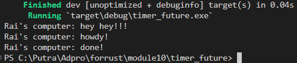
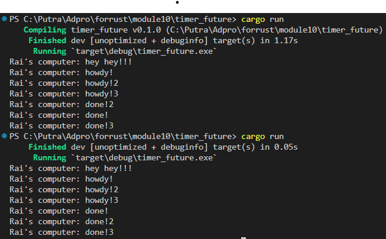
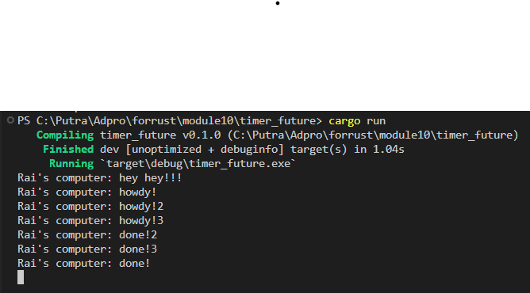

# Reflection

* Fungsi `spawner.spawn(...);` menambahkan tugas *asynchronous* ke *executor*. "hey hey!!!" berada di luar fungsi jadi akan dieksekusi segera setelah tugas *asynchronous* dihasilkan, tetapi sebelum menunggu timer untuk selesai. Karena tugas *asynchronous* membutuhkan waktu untuk menyelesaikan, pesan "hey hey!!!" akan dicetak terlebih dahulu.

### Multiple Spawn

* Semakin banyak fungsi `spawner.spawn(...);` maka semakin banyak juga tugas *asynchronous* yang diciptakan. Tugas-tugas tersebut akan dimasukkan ke dalam *queue*. Namun, urutan pesan-pesan dicetak dapat bervariasi setiap kali program dijalankan karena tugas-tugas berjalan secara konkuren. Hal ini dapat dilihat pada eksekusi program pertama "howdy!2" dicetak sebelum "howdy!" tetapi pada eksekusi kedua "howdy!" dicetak sebelum "howdy!2". *executor* akan terus berjalan sampai *queue* kosong.

### Removing drop(spawner)

Ketika `drop(spawner);` dihilangkan, program terus berjalan karena *executor* akan tetap menunggu tugas baru yang akan ditambahkan ke dalam *queue*.